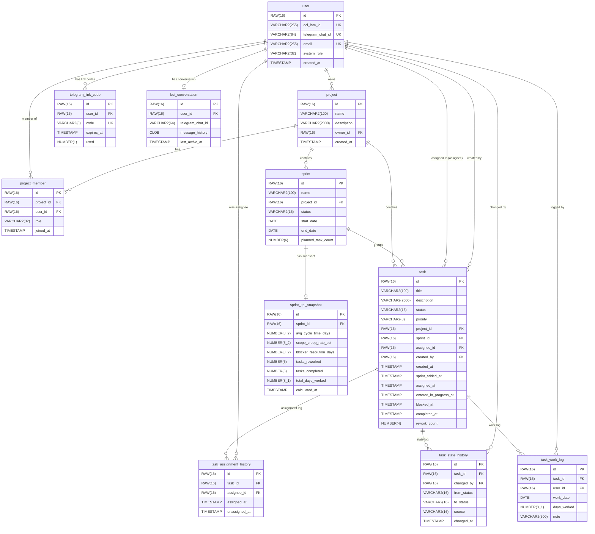

```mermaid
erDiagram
    user {
        RAW(16) id PK
        VARCHAR2(255) oci_iam_id UK
        VARCHAR2(64) telegram_chat_id UK
        VARCHAR2(255) email UK
        VARCHAR2(32) system_role
        TIMESTAMP created_at
    }

    project {
        RAW(16) id PK
        VARCHAR2(100) name
        VARCHAR2(2000) description
        RAW(16) owner_id FK
        TIMESTAMP created_at
    }

    project_member {
        RAW(16) id PK
        RAW(16) project_id FK
        RAW(16) user_id FK
        VARCHAR2(32) role
        TIMESTAMP joined_at
    }

    sprint {
        RAW(16) id PK
        VARCHAR2(100) name
        RAW(16) project_id FK
        VARCHAR2(16) status
        DATE start_date
        DATE end_date
        NUMBER(6) planned_task_count
    }

    task {
        RAW(16) id PK
        VARCHAR2(100) title
        VARCHAR2(2000) description
        VARCHAR2(16) status
        VARCHAR2(8) priority
        RAW(16) project_id FK
        RAW(16) sprint_id FK
        RAW(16) assignee_id FK
        RAW(16) created_by FK
        TIMESTAMP created_at
        TIMESTAMP sprint_added_at
        TIMESTAMP assigned_at
        TIMESTAMP entered_in_progress_at
        TIMESTAMP blocked_at
        TIMESTAMP completed_at
        NUMBER(4) rework_count
    }

    task_assignment_history {
        RAW(16) id PK
        RAW(16) task_id FK
        RAW(16) assignee_id FK
        TIMESTAMP assigned_at
        TIMESTAMP unassigned_at
    }

    task_state_history {
        RAW(16) id PK
        RAW(16) task_id FK
        RAW(16) changed_by FK
        VARCHAR2(16) from_status
        VARCHAR2(16) to_status
        VARCHAR2(16) source
        TIMESTAMP changed_at
    }

    task_work_log {
        RAW(16) id PK
        RAW(16) task_id FK
        RAW(16) user_id FK
        DATE work_date
        NUMBER(3_1) days_worked
        VARCHAR2(500) note
    }

    telegram_link_code {
        RAW(16) id PK
        RAW(16) user_id FK
        VARCHAR2(8) code UK
        TIMESTAMP expires_at
        NUMBER(1) used
    }

    bot_conversation {
        RAW(16) id PK
        RAW(16) user_id FK
        VARCHAR2(64) telegram_chat_id
        CLOB message_history
        TIMESTAMP last_active_at
    }

    sprint_kpi_snapshot {
        RAW(16) id PK
        RAW(16) sprint_id FK
        NUMBER(8_2) avg_cycle_time_days
        NUMBER(5_2) scope_creep_rate_pct
        NUMBER(8_2) blocker_resolution_days
        NUMBER(6) tasks_reworked
        NUMBER(6) tasks_completed
        NUMBER(8_1) total_days_worked
        TIMESTAMP calculated_at
    }

    user ||--o{ project : "owns"
    user ||--o{ project_member : "member of"
    project ||--o{ project_member : "has"
    project ||--o{ sprint : "contains"
    project ||--o{ task : "contains"
    sprint ||--o{ task : "groups"
    sprint ||--o| sprint_kpi_snapshot : "has snapshot"
    user ||--o{ task : "assigned to (assignee)"
    user ||--o{ task : "created by"
    task ||--o{ task_assignment_history : "assignment log"
    user ||--o{ task_assignment_history : "was assignee"
    task ||--o{ task_state_history : "state log"
    user ||--o{ task_state_history : "changed by"
    task ||--o{ task_work_log : "work log"
    user ||--o{ task_work_log : "logged by"
    user ||--o{ telegram_link_code : "has link codes"
    user ||--o| bot_conversation : "has conversation"
```
